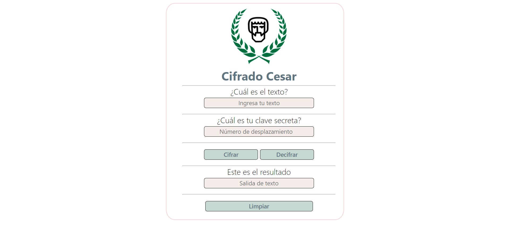
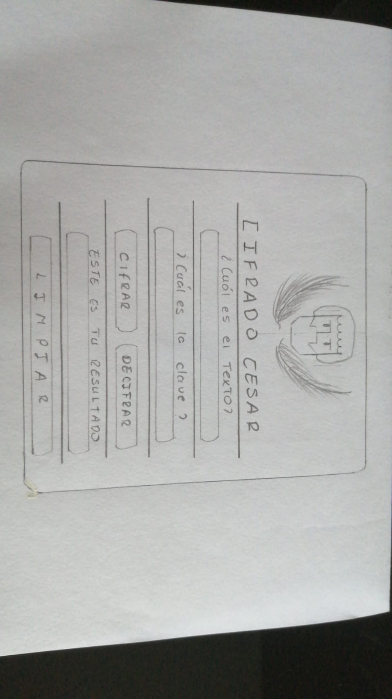
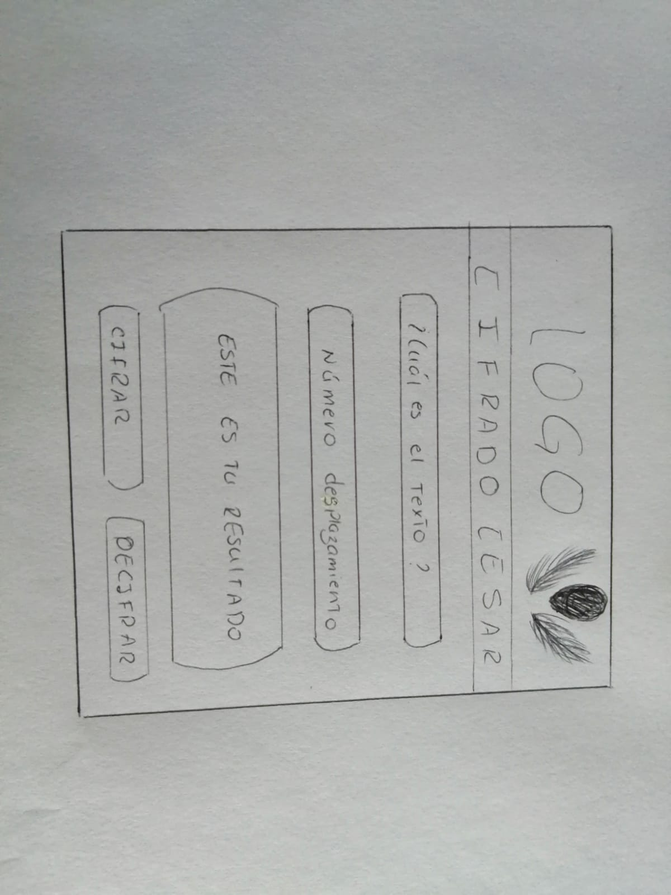

# Cifrado César

## Índice

* [1. Definición del proyecto](#1-definición-del-proyecto)
* [2. Resultado final](#2-resultado-final)
* [3. Diseño de experiencia del Usuario](#3-diseño-de-experiencia)
  - [Usuarios destinados y objetivos](#4-Usuarios-destinados)
  - [Solución a problemas del usuario](#5-solución-a-problemas)
  - [Prototipo de baja fidelidad](#6-prototipo-de-baja-fidelidad)
  - [Prototipo de alta fidelidad](#7-prototipo-de-alta-fidelidad)
  - [Feedback](#8-feedback)

***

## 1. Definición del proyecto
Cesar tiene como finalidad garantizar la seguridad de las contraseñas de los clientes sin la necesidad de eliminar la costumbre de almacenar las contraseñas en un lugar accesible. Podrás mantener tus claves cifradas en el block de notas, y con Cifrado Cesar podrás escoger una clave secreta para así poder acceder a la contraseña descifrada que necesites. Es más fácil recordar un número que 10 contraseñas.

## 2. Resultado final

## 3. Diseño de Experiencia de Usuario

### Usuarios destinados y objetivos
Cifrado Cesar es una aplicación web destinada a todo aquel usuario que necesite mantener sus claves accesibles pero seguras para evitar cualquier tipo de robo.

### Solución a problemas de usuario
Con el paso del tiempo, existen cada vez más aplicaciones en las que se requieren contraseñas para mantener nuestros datos en privado y evitar robos de información, o de dinero. Esto implica tener una amplia variedad de contraseñas distintas para cada aplicación. Recordar distintas contraseñas puede ser pesado o hasta peligroso, ya que muchas personas optan por almacenar sus contraseñas en el block de notas de sus celulares, ampliando las posibilidades de que, en caso de un robo o pérdida de celular, se pueda acceder muy fácilmente a esta información. Con Cifrado Cesar puedes mantener tus contraseñas a la mano y a la vez seguras manteniéndolas cifradas para descifrarlas cada vez que necesites.

### Prototipo de baja fidelidad

### Prototipo de alta fidelidad

### Feedback

* Primer feedback:

  - Agregar un botón para limpiar la información
  - Agregar información en el input para que se entienda mejor qué significa “clave secreta”
 
* Segundo feedback:

  - Mantener armonía en los colores
  - AAñadir bordes para que se vea delimitado
  - CAñadir colores llamativos a los botones